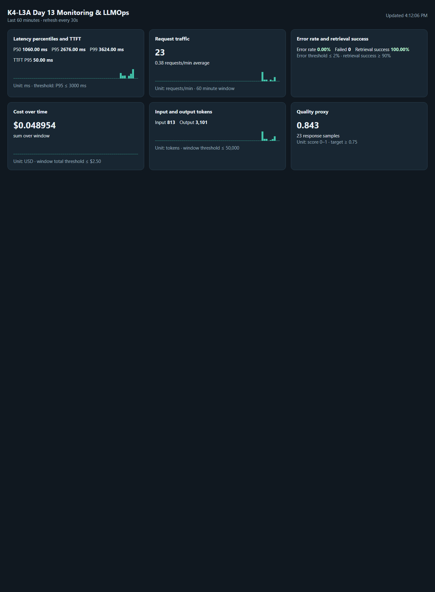

# Báo cáo cá nhân — K4-L3A Day 13 Monitoring & LLMOps

## 1. Thông tin học viên

- **Họ và tên:** Trần Thị Như Ý
- **MSSV:** 2A202602372
- **Lớp:** K4-L3A
- **Repository:** `K4-L3-DAY13-TranThiNhuY-2A202602372-Monitoring-LLMOps`
- **Repository URL:** https://github.com/nhuY02/K4-L3-DAY13-TranThiNhuY-2A202602372-Monitoring-LLMOps
- **Commit SHA cuối:** _điền SHA hex sau khi commit và push (không điền URL vào trường này)_
- **Challenge ID:** `day13-k4-l3a-monitoring-llmops-v1` (cohort K4; `config/challenge.json` lấy từ release "Challenge File" của repo đề, không sửa, không commit).
- **Project Langfuse cá nhân:** `day13-k4-l3a-2A202602372` (region US, `us.cloud.langfuse.com`).

## 2. Evidence index

| # | Evidence | File | ID chính | Dạng |
|---|---|---|---|---|
| 01 | Pytest cuối | [01-pytest.txt](evidence/01-pytest.txt) | 57 passed | output lệnh |
| 02 | Log validator cuối | [02-log-validator.txt](evidence/02-log-validator.txt) | 100/100 | output lệnh |
| 03 | Dashboard validator | [03-dashboard-validator.txt](evidence/03-dashboard-validator.txt) | 6/6 panel | output lệnh |
| 04 | Structured log | [04-structured-log.md](evidence/04-structured-log.md) | `req-ba5e0011` | trích xuất log |
| 05 | PII redaction | [05-pii-redaction.md](evidence/05-pii-redaction.md) | `req-a1b2c3d4` | trích xuất log |
| 06 | Trace list (21 traces) | [06-trace-list.md](evidence/06-trace-list.md) | 21 trace ID | export Langfuse API |
| 07 | Trace waterfall | [07-trace-waterfall.md](evidence/07-trace-waterfall.md) | `2c423dcf…` | export Langfuse API |
| 08 | Trace metadata | [08-trace-metadata.md](evidence/08-trace-metadata.md) | `2c423dcf…` | export Langfuse API |
| 09 | Prompt versions | [09-prompt-versions.md](evidence/09-prompt-versions.md) | `day13-chat` v1/v2 | export Langfuse API |
| 10 | Prompt promote/rollback | [10-prompt-rollback.md](evidence/10-prompt-rollback.md) | 4 trace ID | export Langfuse API |
| 11 | Dashboard runtime |  | `/dashboard` | ảnh PNG |
| 12 | Incident metric | [12-incident-metric.md](evidence/12-incident-metric.md) | P95 3624 ms | tính từ log |
| 13 | Incident log | [13-incident-log.md](evidence/13-incident-log.md) | `req-a214b648` | trích xuất log |
| 14 | Incident trace | [14-incident-trace.md](evidence/14-incident-trace.md) | `fe47bc4c…` | export Langfuse API |
| — | Baseline log validator | [baseline-log-validator.txt](evidence/baseline-log-validator.txt) | 30/100 | output lệnh |

Các evidence `04`–`10` và `12`–`14` là dữ liệu trích xuất từ runtime (log) và Langfuse Public API, đã trình bày lại bằng Markdown để dễ đối chiếu. Theo `docs/SUBMISSION.md`, các mục này vẫn cần **ảnh chụp màn hình runtime/UI**; hiện mới có ảnh `11-dashboard-overview.png`. Sau khi chụp, đặt ảnh PNG cùng số thứ tự (ví dụ `06-trace-list.png`) và thêm vào bảng trên.

## 3. Kết quả kỹ thuật

| Nội dung | Baseline (starter) | Kết quả cuối |
|---|---:|---:|
| `validate_logs.py` | 30/100 (28 record, 20 thiếu field/enrichment, 0 correlation ID) | 100/100, 64 record, 26 correlation ID, 0 PII leak |
| `validate_dashboard.py` | không lưu output baseline | 6/6 panel |
| `pytest` | không lưu output baseline | 57 passed |
| Traces trong Langfuse | 0 child observation | 21 traces, mỗi trace có root `agent` + `retriever` + `generation` |
| Latency P50/P95/P99 (toàn cửa sổ 60 phút) | chưa đo | 1060 / 2676 / 3624 ms |
| Latency trước/trong CP3 challenge | trước incident: n=18, 152 / 1864 / 2134 ms | trong incident: n=5, 2653 / 3624 / 3624 ms |
| TTFT P95 | chưa đo | 50 ms |
| Error rate / retrieval success | chưa đo | 0% / 100% |
| Cost / tokens in / out | chưa đo | 0.048954 USD / 813 / 3101 |
| Quality proxy mean | chưa đo | 0.843 (23 mẫu) |

## 4. Logging và PII

- `app/middleware.py`: `clear_contextvars()` đầu và cuối request; nhận `x-request-id` nếu đúng `req-<8 hex>`, ngược lại sinh `req-<uuid4[:8]>`; trả `x-request-id` và `x-response-time-ms`. Ví dụ request `req-a1b2c3d4` trả `x-response-time-ms: 166.52`.
- `app/main.py`: bind `correlation_id`, `user_id_hash`, `session_id`, `feature`, `model`, `env` trước `request_received`.
- `app/logging_config.py`: `scrub_event` đứng sau `TimeStamper` và trước `JsonlFileProcessor`/`JSONRenderer`, scrub đệ quy mọi string trong dict/list/tuple.
- `app/pii.py`: pattern email, điện thoại VN (`0`/`+84`, có khoảng trắng/chấm/gạch), CCCD 12 số, thẻ 16 số. Tests trong `tests/test_pii.py` và `tests/test_chat_observability.py`.
- Runtime: request PII giả `req-a1b2c3d4` được log thành `[REDACTED_EMAIL]`, `[REDACTED_PHONE_VN]`, `[REDACTED_CCCD]`, `[REDACTED_CREDIT_CARD]`; grep giá trị gốc trong `data/logs.jsonl` ra 0 kết quả ([05-pii-redaction](evidence/05-pii-redaction.md)). Validator chạy lại trên source hiện tại: 64 record, 26 correlation ID, 100/100, 0 phát hiện PII.

## 5. Tracing và prompt versioning

- Cây observation: `lab-agent-run` (AGENT, root) → `retrieval` (RETRIEVER) và `llm-generation` (GENERATION). Xem [07-trace-waterfall](evidence/07-trace-waterfall.md) cho trace `2c423dcf781b71e37c369d31cb56f59c`.
- Generation gửi `model`, `usage_details` (input/output), `cost_details` (giá $3/$15 trên 1M token) và link `prompt` tới managed prompt; Langfuse ghi nhận `promptName=day13-chat`, `promptVersion`, `totalCost`.
- `correlation_id`, `feature`, `model` được propagate vào metadata mọi observation; user id là hash, retrieval chỉ ghi `query_preview` đã scrub và `document_count`, không capture raw prompt/output ([08-trace-metadata](evidence/08-trace-metadata.md)).
- Prompt `day13-chat`: v1 (`baseline`, `production`) là template gốc; v2 (`candidate`) thêm dòng "Answer in at most 3 concise bullet points." ([09-prompt-versions](evidence/09-prompt-versions.md)).
- Cùng input `feature=qa`, "Explain why metrics traces and logs work together" ([10-prompt-rollback](evidence/10-prompt-rollback.md)):

| Bước | Label app dùng | Trace ID | correlation_id | Prompt version |
|---|---|---|---|---:|
| Baseline | `baseline` | `2c423dcf781b71e37c369d31cb56f59c` | `req-ba5e0011` | 1 |
| Candidate | `candidate` | `97ec27143efb9cb792fe2826e555be87` | `req-cad10002` | 2 |
| Promote `production` → v2 | `production` | `5f1f9a56f748c303b971340b1a684a9f` | `req-0f0d0013` | 2 |
| Rollback `production` → v1 | `production` | `78f725bba5d5c77b003926aa2c333e6e` | `req-0b1c0014` | 1 |

Trạng thái label cuối: v1 = `baseline, production`; v2 = `candidate, latest`.

## 6. Dashboard, SLO và alerts

- Dashboard: `app/dashboard.py`, mở tại `/dashboard`, nguồn `data/logs.jsonl`, time range 60 phút, refresh 30 giây. Sáu panel: latency P50/P95/P99 + TTFT (ms, SLO line 3000 ms), traffic (req/phút), errors + retrieval success (%, ngưỡng 2%), cost (USD, 2.5), tokens in/out (50 000), quality (0–1, 0.75). Ảnh: [11-dashboard-overview.png](evidence/11-dashboard-overview.png).
- SLO (`config/slo.yaml`): 99.5% request trả `response_sent` với `latency_ms ≤ 3000` trong rolling 28 ngày. Error budget = (1 − 0.995) × số request = 0.5%; 10 000 request → 50 request xấu. Ngưỡng 3000 ms được giữ vì baseline bình thường có P95 1864 ms, còn khoảng dư cho P99 nhưng bắt được `rag_slow` (+2500 ms).
- Alerts (`config/alert_rules.yaml`, runbook `docs/alerts.md`), cùng kênh Slack `#llmops-alerts`:
  1. Latency P95 > 3000 ms trong 5m — warning — LLM Platform On-call.
  2. Error rate > 2% trong 5m — critical — API On-call.
  3. Retrieval success < 90% trong 10m — warning — Retrieval On-call.

## 7. Điều tra challenge

Chạy `python scripts/inject_incident.py` rồi `python scripts/load_test.py --challenge --concurrency 5` (API có tracing bật). Incident bật lúc 09:10:23Z, tắt lúc 09:10:53Z ngày 2026-09-29 (UTC).

1. **Metric** ([12-incident-metric](evidence/12-incident-metric.md)): trong khoảng 09:10:28Z–09:10:40Z, 5 request `feature=monitoring` có latency P50 2653 ms, P95/P99 3624 ms, cao hơn ngưỡng challenge 2000 ms và SLO 3000 ms. Trước sự cố, P95 là 1864 ms. TTFT P95 vẫn 50 ms, retrieval success 5/5, error 0%. Vậy đây là sự cố chậm, không phải sự cố lỗi, và phần chậm nằm trước bước sinh token.
2. **Log** ([13-incident-log](evidence/13-incident-log.md)): request chậm nhất là `req-a214b648`, `response_sent` lúc `2026-09-29T09:10:28.969Z`, `latency_ms=3624`, `ttft_ms=50`, `tool_success=true`. Bốn request còn lại: `req-d6fcfb37`, `req-4c7596ed`, `req-8064368c`, `req-3a633748` (~2652–2676 ms).
3. **Trace** ([14-incident-trace](evidence/14-incident-trace.md)): trace `fe47bc4c4863d5f87bd5475bb657f61e` có `correlation_id=req-a214b648`. Root `lab-agent-run` 3.625 s, `retrieval` 2.502 s, `llm-generation` 0.154 s. Cả năm trace đều có `retrieval` ≈ 2.50 s, trong khi generation ≈ 0.15 s, giống lúc bình thường.
4. **Span gây ảnh hưởng:** `retrieval` (RETRIEVER), chiếm khoảng 69–94% thời gian của request.
5. **Root cause:** incident `rag_slow` thêm độ trễ cố định 2.5 s vào `app/mock_rag.py::retrieve`. Retrieval vẫn trả document, nên retrieval success và error rate không đổi, chỉ có latency tăng. Ba tín hiệu metric, log và trace cùng chỉ về một nguyên nhân.
6. **Fix action:** tắt incident bằng `python scripts/inject_incident.py --disable`. API xác nhận `rag_slow=false`. Kiểm chứng lại bằng request `req-f1ed0001` với cùng query challenge: latency còn 151 ms.
7. **Preventive measure:** đặt timeout cho retrieval (ví dụ 800 ms) với fallback không dùng context. Thêm metric và alert riêng cho P95 của span `retrieval`, để không phải suy ra từ tổng latency. Cache kết quả cho các query lặp lại. Thêm test hiệu năng cho trường hợp retrieval chậm trước khi deploy.

Lưu ý: request đầu (`req-a214b648`) chậm hơn khoảng 1 s so với 4 request còn lại, nhưng phần tăng thêm không nằm trong `retrieval` hay `llm-generation`. Nhiều khả năng đây là độ trễ lúc khởi động của lần fetch prompt đầu tiên sau khi restart API. Mình chưa kiểm chứng được giả thuyết này nên không tính vào root cause.

## 8. Giải thích và tự đánh giá

- **Quyết định kỹ thuật:** tách retrieval và generation thành hai hàm có `@observe` riêng (`_traced_retrieve`, `_traced_generate`), thay vì bọc chung trong root. Nhờ vậy Langfuse đo được thời gian từng bước, và CP3 khoanh được span `retrieval` bằng số liệu chứ không phải suy đoán. Mình cũng tắt `capture_input/capture_output` và chỉ gửi preview đã scrub, để không có PII trong trace.
- **Blocker 1:** API cũ đang chạy trên cổng 8000 vẫn dùng source chưa sửa, nên trả `correlation_id=MISSING`. Cách xử lý: chạy bản mới trên cổng khác (thêm `--base-url` cho `load_test.py` và `inject_incident.py`), rồi lưu log cũ ra ngoài trước khi đo lại.
- **Blocker 2:** tài khoản Langfuse tạo sau 16/09/2026 không còn dùng được `GET /api/public/traces` (trả HTTP 410). Cách xử lý: chuyển sang `GET /api/public/v2/observations` để xác minh trace và export evidence. Ngoài ra, khi restart uvicorn quá nhanh, vài trace chưa kịp flush bị mất, nên mình chạy lại bước baseline/promote và chờ flush trước khi restart.
- **Metrics → Logs → Traces:** metric cho biết có vấn đề gì và trong khoảng thời gian nào (P95 tăng, TTFT không đổi). Log tìm ra request cụ thể qua `correlation_id` trong khoảng thời gian đó. Trace của đúng `correlation_id` đó cho biết bước nào tốn thời gian (`retrieval` 2.5 s).
- **Prompt version, token/cost, SLO, rollback:**
  - Mỗi trace ghi lại prompt version, nên khi chất lượng hay cost thay đổi có thể biết request đó dùng version nào.
  - Rollback chỉ là chuyển label `production`, không cần deploy lại code.
  - Token và cost theo từng generation cho phép so sánh các version theo tiền thật.
  - SLO cùng error budget cho biết mức chậm hoặc lỗi còn chấp nhận được, và khi nào phải dừng thay đổi để ưu tiên ổn định.
- **Điều học được:** validator 100/100 và 6/6 chỉ xác nhận đúng contract. Chính trace mới cho biết thời gian nằm ở bước nào.
- **Hạn chế, Rủi ro tiềm ẩn & Giải pháp đề xuất:**
  - *I/O Contention & Scalability:* Dashboard hiện tại quét toàn bộ `logs.jsonl` (đồng bộ). Khi file log vượt 100MB, sẽ gây nghẽn Event Loop. *Giải pháp:* Tách pipeline sang in-memory time-series buffer (Prometheus exporter/Ring buffer) hoặc lưu log vào ClickHouse/Elasticsearch.
  - *PII Coverage Boundary:* Hiện tại dựa vào regex cứng cho 4 định danh phổ biến (email, phone, CCCD, thẻ). Không bắt được địa chỉ tự nhiên, mã số thuế hay thông tin bệnh án. *Giải pháp:* Tích hợp Local NER (như Presidio/SpaCy) chạy bất đồng bộ trong background audit stream.
  - *Langfuse Network Failure:* Nếu Langfuse Cloud bị treo mạng (high latency), SDK có thể block API dù đã có fallback. *Giải pháp:* Áp dụng Circuit Breaker pattern (ngắt kết nối sau 3 lần fail) kèm strict socket timeout 500ms.
  - *Cascading Delay trong RAG:* Sự cố `rag_slow` chứng minh nếu retrieval không có timeout cứng thì toàn bộ request bị chậm dây chuyền. *Giải pháp:* Thiết lập `asyncio.wait_for(timeout=0.8s)` cho retriever kèm graceful degradation (fallback LLM knowledge).
  - *Heuristic Cost & Quality:* Giá token và quality score hiện là proxy/ước tính nội bộ của FakeLLM. *Giải pháp:* Tích hợp model evaluation tự động (LLM-as-a-judge / Ragas / DeepEval) lấy mẫu trên 5% traffic production.

## 9. Checklist trước khi nộp

- [x] Tests, log validator và dashboard validator chạy lại trên source cuối ngày 2026-10-04: 57 passed, 100/100, 6/6.
- [x] Structured log, PII redaction có evidence.
- [x] ≥10 traces trong project cá nhân, waterfall, metadata, prompt v1/v2, promote và rollback.
- [ ] Ảnh chụp UI Langfuse cho evidence `06`–`10` và `14`; các bản export text hiện có không thay thế ảnh theo `docs/SUBMISSION.md`.
- [ ] Ảnh runtime structured log, PII redaction và incident log/metric (`04`, `05`, `12`, `13`); các file text hiện tại chỉ là dữ liệu trích xuất.
- [x] Dashboard runtime có dữ liệu; SLO/error budget; 3 alert + runbook.
- [x] Incident metric → log → trace cùng `correlation_id`.
- [x] Đủ 14 file evidence được đánh số `01`–`14`. Quét secret toàn repo ngày 2026-10-04 chỉ thấy placeholder `sk-lf-...` trong docs. `.env`, `.venv/`, `.venv312/`, `data/logs.jsonl` và `config/challenge.json` đều bị gitignore và không được track.
- [x] Mục 1 đã dùng tên repo chuẩn `K4-L3-DAY13-TranThiNhuY-2A202602372-Monitoring-LLMOps`.
- [ ] Đổi tên repo trên GitHub cho khớp URL ở mục 1, commit, push và điền commit SHA.
- [ ] Nộp URL và SHA trên VLearn.
